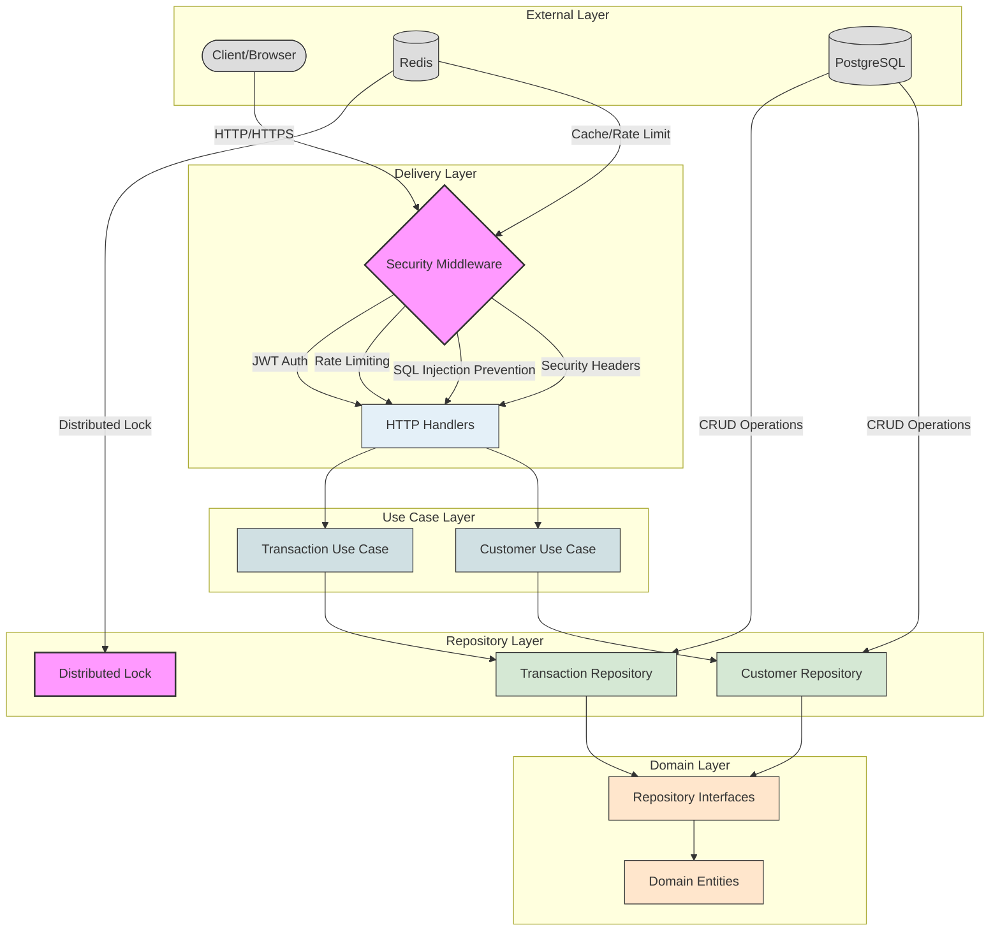

```mermaid
flowchart TB
    %% External Layer
    Client([Client/Browser])
    Redis[(Redis)]
    PostgreSQL[(PostgreSQL)]

    %% Delivery Layer
    SecurityMiddleware{Security Middleware}
    HTTPHandler[HTTP Handlers]

    %% Use Case Layer
    CustomerUseCase[Customer Use Case]
    TransactionUseCase[Transaction Use Case]

    %% Repository Layer
    CustomerRepo[Customer Repository]
    TransactionRepo[Transaction Repository]
    DistributedLock[Distributed Lock]

    %% Domain Layer
    Entities[Domain Entities]
    Interfaces[Repository Interfaces]

    %% External connections
    Client --> |HTTP/HTTPS| SecurityMiddleware
    Redis --> |Cache/Rate Limit| SecurityMiddleware
    Redis --> |Distributed Lock| DistributedLock
    PostgreSQL --> |CRUD Operations| CustomerRepo
    PostgreSQL --> |CRUD Operations| TransactionRepo

    %% Security Middleware components
    SecurityMiddleware --> |Security Headers| HTTPHandler
    SecurityMiddleware --> |SQL Injection Prevention| HTTPHandler
    SecurityMiddleware --> |Rate Limiting| HTTPHandler
    SecurityMiddleware --> |JWT Auth| HTTPHandler

    %% Internal flow
    HTTPHandler --> CustomerUseCase
    HTTPHandler --> TransactionUseCase
    CustomerUseCase --> CustomerRepo
    TransactionUseCase --> TransactionRepo
    CustomerRepo --> Interfaces
    TransactionRepo --> Interfaces
    Interfaces --> Entities

    %% Styling
    classDef external fill:#ddd,stroke:#333
    classDef security fill:#f9f,stroke:#333,stroke-width:2px
    classDef delivery fill:#e4f0f8,stroke:#333
    classDef usecase fill:#d0e0e3,stroke:#333
    classDef repository fill:#d5e8d4,stroke:#333
    classDef domain fill:#ffe6cc,stroke:#333

    class Client,Redis,PostgreSQL external
    class SecurityMiddleware,DistributedLock security
    class HTTPHandler delivery
    class CustomerUseCase,TransactionUseCase usecase
    class CustomerRepo,TransactionRepo repository
    class Entities,Interfaces domain

    %% Subgraphs for layers
    subgraph External Layer
        Client
        Redis
        PostgreSQL
    end

    subgraph Delivery Layer
        SecurityMiddleware
        HTTPHandler
    end

    subgraph Use Case Layer
        CustomerUseCase
        TransactionUseCase
    end

    subgraph Repository Layer
        CustomerRepo
        TransactionRepo
        DistributedLock
    end

    subgraph Domain Layer
        Entities
        Interfaces
    end
``` 